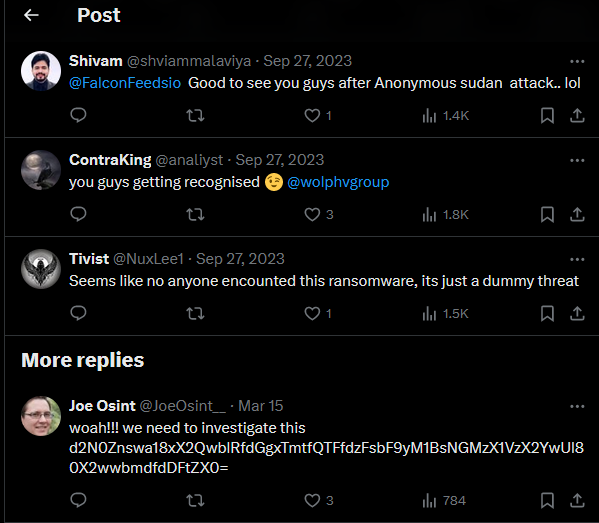

# Solve
- Look up "Wolphv" on a search engine like Google
- Find this [article](https://thecyberexpress.com/new-wolphv-ransomware-group-on-the-dark-web/)

- See that FalconFeeds.io is mentioned as first reporting on Wolphv

- Find FalconFeeds twitter/x post on Wolphv 

- Find the flag in the comments

- Decode `d2N0Znswa18xX2QwblRfdGgxTmtfQTFfdzFsbF9yM1BsNGMzX1VzX2YwUl80X2wwbmdfdDFtZX0=` to get flag:
- Flag: `wctf{0k_1_d0nT_th1Nk_A1_w1ll_r3Pl4c3_Us_f0R_4_l0ng_t1me}`

## Author's Notes
- This is based off our internal CTF where we created a fake ransomware gang called Wolphv (kinda like Alphv, get it??) and a couple of AI threat detection platforms thought it was real and reported on it.