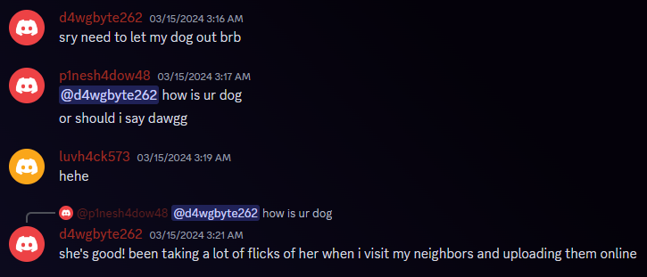
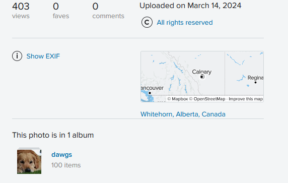
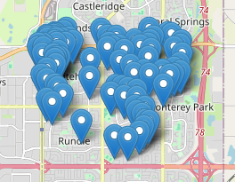
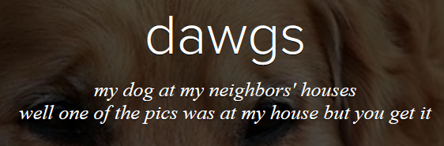
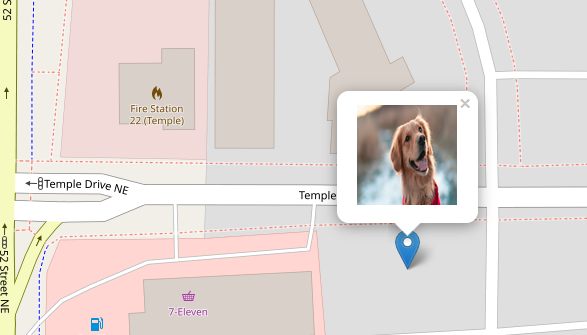

# Solve
- See in the discord that dawgbyte262 has a dog, and has been posting "flicks"
- Check flickr for [dawgbyte262's account](https://www.flickr.com/people/200261418@N03/)

- Notice each picture has EXIF data with a location in Calgary

- Download the [*dawgs* album](https://www.flickr.com/photos/200261418@N03/albums/72177720315465844/) and use a tool like [this one](https://www.freemaptools.com/view-and-edit-photo-gps-data.htm) from freemaptools to map the photos

- Notice all the photos are centered around the same location

- In the discord dawgbyte262 says the following
> i live the closest to a fire station out of all my friends who are neighbors they dont understand my pain
>
> 

- We know that one of the photos is at dawgbyte262's house from the album description

- Find the only fire station in that are and the photo closest to it

- Get the metadata of the photo with `exiftool -n -GPSLatitude -GPSLongitude -GPTAltitude dog83_53587288342_o.jpg` Output:
```console
GPS Latitude                	: 51.0911666999528
GPS Longitude               	: -113.956166699953
GPS Altitude                	: 1044.854
```
- Accepted flags: `wctf{51.0911,-113.9561}, wctf{51.0912,-113.9561}, wctf{51.0912,-113.9562}`