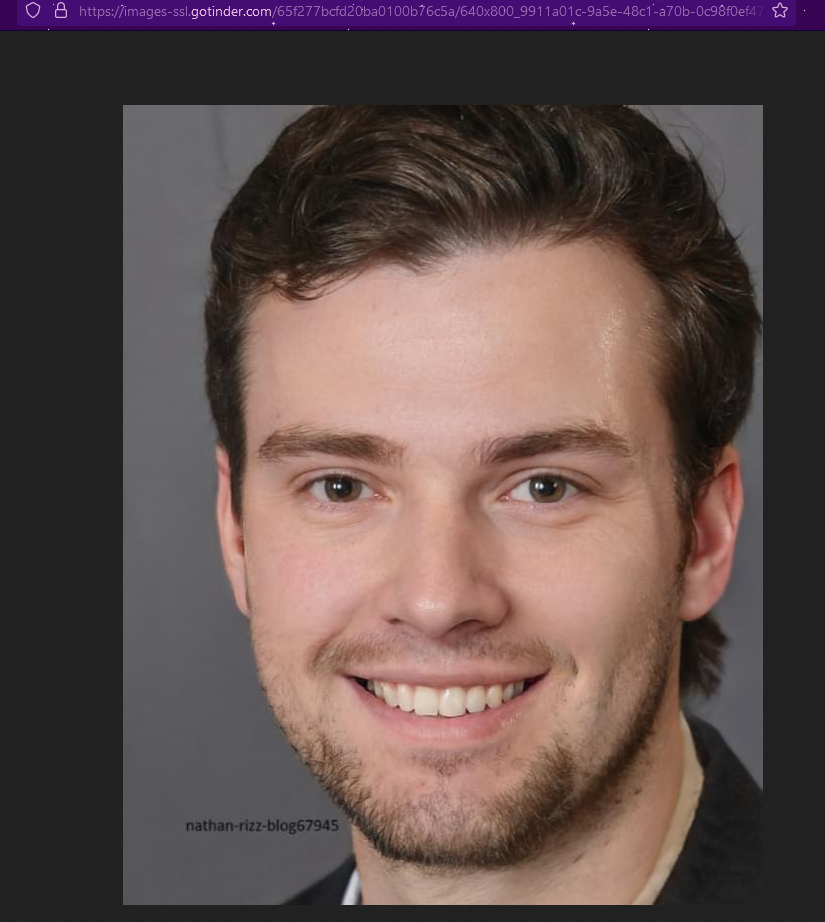
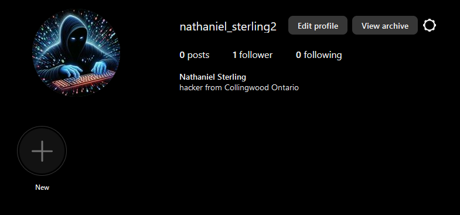

# Solve
- In the WOLPHV Discord, luvh4ck573 said he is dating, and finding people by "the usual" He also says he is "the luv h4ck"

- Checking a for a tinder profile with the name *luvh4ck573* by using `https://tinder.com/@luvh4ck573` yields a picture of someone named Nathaniel

- We can open the image by right clicking and saving to reveal text saying `nathan-rizz-blog67945`

- Searching for `nathan rizz blog67945` yields a hit on Tumblr at tumblr.com/nathan-rizz-blog67945. Tumblr is a social media platform well known for having blogs.

- We see a post from Nathan with a [video he made on youtube](https://www.youtube.com/watch?v=ZEJdSXbglZs)

- Performing a wayback search on the video shows it was [captured on the 14th](https://web.archive.org/web/20240314070313/https://www.youtube.com/watch?v=ZEJdSXbglZs) and there's a description in the video saying
> business inquiries: nathaniels523523@gmail.com

- We can search on [epieos](https://epieos.com/) to get the users name is Nathaniel Sterling. You can also use a tool like [GHunt](https://github.com/mxrch/GHunt) to get the profile picture for free

- Searching for Nathaniel Sterling on Instagram gives us a user with the same profile picture

- We get that they live in Collingwood Ontario from their bio

- From the Discord we know they live close to a Subway, McDonalds, and a pizza place

- From Nathan's blog we know that he lives in an apartment and there's a bus stop right outside

- We can use Google Maps in Collingwood, Ontario to narrow down the search to apartments, and the ones close to the McDonalds & Subway

- Outside King George Appartments, we can see a bus stop

- This confirms that [this](https://maps.app.goo.gl/FfUVUQcQNWq1ACR49) is the correct location
- Accepted Flags: `wctf{44.499,-80.228}, wctf{44.500,-80.228}`