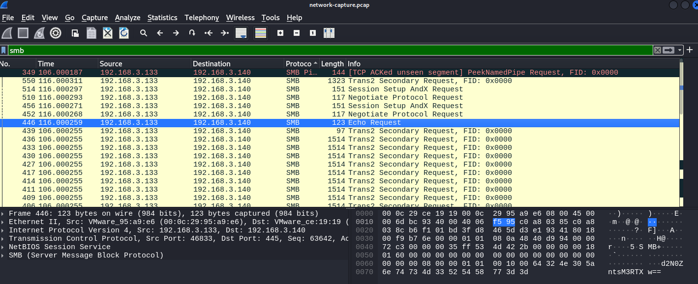
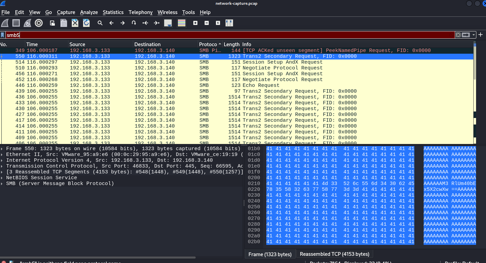
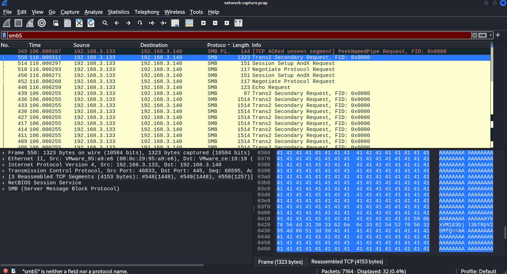

# Solve
- Notice something is up with the SMB traffic, possibly by indicators of compromise
- Identify attack is MS17-10 EternalBlue, perform [analysis](https://secportfolio.com/eternalblue-exploit-wireshark-analysis/)
- Find flag in echo request and Trans2 Secondary Request, both part of MS17-10 payload 



- 
- 3 strings are
```
d2N0ZntsM3RTXw==

M3RlUm40bEx5X2cwXw==

YkxVM183bjl3bTRpV25MfQ==
```
Flag: `wctf{l3tS_3teRn4lLy_g0_bLU3_7n9wm4iWnL}`