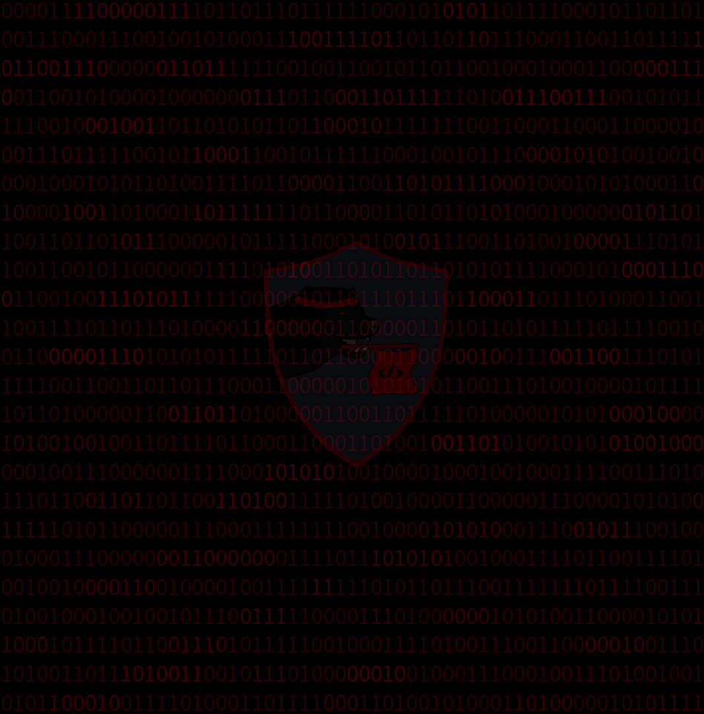

# Solve
- Notice the background has a repeating image of binary, right click to download image

- Get the binary out of the background, can use sites like Google Images to extract the binary
```
00001111000001111011011101111110001010101101111000101101101001110001110010010100011100111101101101101110001100110111110110011100000011011111100100110010110110010001000110000011100110010100001000000011101100011011111101001110011100101011111001000100110110101011011000101111111001100011000110000100011101111100101100011001011111100010010111000010101001001000010001010110100111101100001100110101111000100010101000110100001001101000110111111101100001101011010100010000001011011001101101011100000101111100010100101110011010010000111010110011001011000000111101010011010110110101011110001010001110011001001110101111110000010110111011101100011011101000110011001111011011101000011000000110000011010110101111101111001001100000111010101011111011011000011000001001110011001110101111100110011011011100011000001010101011001110100100001011111011010000011001101101000001100110111110100000101010001000010100100100110111101100011000110100100110101001010101001000000100111000000111100010101010010000100010010001111001110101110110011011011001101001111101001000011000001110000101010011111010110000011100011111111001000010101000111001011100100010001110000000110000000111101110101010010001111011001111010010010000110010000100111111111010110111001111111011110011101001000100100101110011111000011101000000101010011000010101100010111101100111010111110010001111010011100110000010011101010011011101001100101110100000010010001110001001110100100101011000100111101000110111100011010010100011010000010101111
```
- Have a program keep iterating through the binary changing the start index, until a flag is found OR
- Use the fact `wctf{` is `0111011101100011011101000110011001111011` in binary
- Make sure the binary starts with `0111011101100011011101000110011001111011` and decode to get: `wctf{t00k_y0u_l0Ng_3n0UgH_h3h3}D)&ö1¤Ôª@œHD:ìÛ4úC...`
- Not having the binary start with that will change the decoding pattern of the binary, thus not (likely) getting the flag
```

- Flag: `wctf{t00k_y0u_l0Ng_3n0UgH_h3h3}`